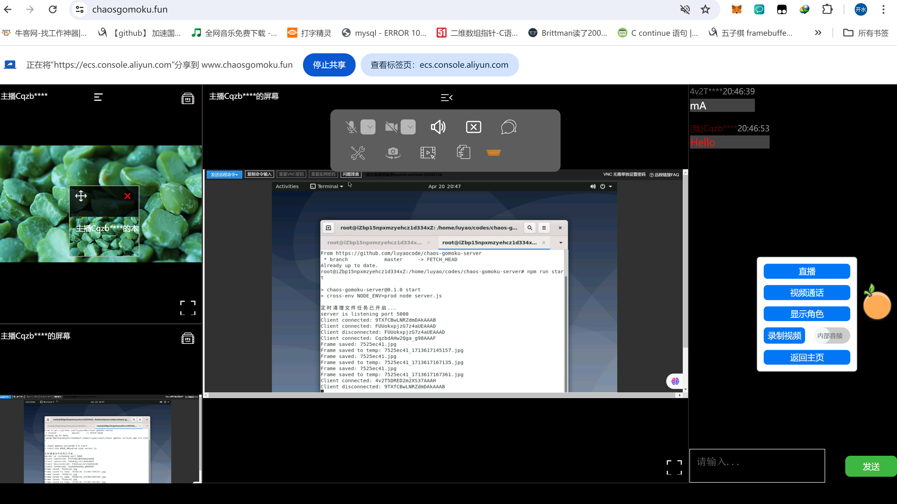

# 基于WebRTC的会议、直播和视频通话系统

### 项目介绍

- 视频通话
- 短信聊天
- 在线直播
- 文件互传
- 共享屏幕
- 多人会议
- ...




### 准备阶段

1. 前端配置

   新建.env配置文件，填写如下配置：

   ```ini
   # 生产环境
   REACT_APP_BACKEND_URL=[1]
   REACT_APP_BACKEND_HTTP=[2]
   # 开发环境
   REACT_APP_BACKEND_URL_DEV=[3]
   REACT_APP_BACKEND_HTTP_DEV=[4]
   
   # STUN服务器用户名和密码
   REACT_APP_STUN_URL=[5]
   REACT_APP_TURN_URL=[6]
   REACT_APP_TURN_USERNAME=[7]
   REACT_APP_TURN_CREDENTIAL=[8]
   
   #备注
   #[1]生产环境后端服务器地址，格式：wss://abc.com:5000
   #[2]生产环境后端服务器地址，格式：https://abc.com:5000
   #[3]开发环境后端服务器地址，格式：ws://localhost:5000
   #[4]开发环境后端服务器地址，格式：http://localhost:5000
   #[5]STUN地址，格式：STUN:xx.xx.xx.xx:3478
   #[6]TURN地址，格式：TURN:xx.xx.xx.xx:3478
   #[7]TURN服务器自定义的用户名
   #[8]TURN服务器自定义的用户密码
   ```

2. 后端配置（信令服务器配置）

   [请移步到这里](https://github.com/luyaocode/chaos-gomoku-server)

3. Coturn服务器配置

   安装Coturn服务器，在/etc/turnserver.conf中填写如下配置

   ```ini
   #公网ip地址
   realm=[1]
   #默认监听端口
   listening-port=3478
   #默认监听IP（局域网ip地址）
   listening-ip=[2]
   #公网IP
   external-ip=[3]
   #通信端口范围（需要在网络安全策略中开放服务器本段UDP端口）
   min-port=49152
   max-port=65535
   #加密
   fingerprint
   lt-cred-mech
   #用于使用者身份识别
   user=[4]
   syslog
   
   #备注
   #本文件是Coturn服务器的简易版配置文件模板
   #[1][3]处填写Coturn服务器公网ip地址
   #[2]处填写Coturn服务器私有ip地址
   #[4]处填写自定义的用户账号密码
   ```

4. mediasoup流媒体服务器配置

   ```tsx
   import { RtpCodecCapability, TransportListenIp, WorkerLogTag } from 'mediasoup/node/lib/types';
   import * as os from 'os';
   
   export const config = {
       listenIp: '0.0.0.0',
       listenPort: 3016,
   
       mediasoup: {
           numWorkers: Object.keys(os.cpus()).length,
           worker: {
               rtcMinPort: 10000,
               rtcMaxPort: 11000,
               logLevel: 'debug',
               logTags: [
                   'info',
                   'ice',
                   'dtls',
                   'rtp',
                   'srtp',
                   'rtcp',
               ] as WorkerLogTag[],
           },
           router: {
               mediaCodes: [
                   {
                       kind: 'audio',
                       mimeType: 'audio/opus',
                       clockRate: 48000,
                       channels: 2,
                   }, {
                       kind: 'video',
                       mimeType: 'video/VP8',
                       clockRate: 90000,
                       parameters: {
                           'x-google-start-bitrate': 1000,
                       }
                   }
               ] as RtpCodecCapability[],
           },
           // webrtctransport settings
           webRtcTransport: {
               listenIps: [
                   {
                       ip: '0.0.0.0',
                       announcedIp: '127.0.0.1', // replace by public IP address
                   }
               ] as TransportListenIp[],
               maxIncomeBitrate: 1500000,
               initialAvailableOutgoingBitrate: 1000000,
   
           }
       }
   } as const;
   
   // 注意：生产环境中，webRtcTransport[listenIps][announcedIp]需要修改为实际服务器公网
   ```

# 混乱五子棋

### 项目介绍

在传统五子棋玩法上加上特殊道具加成，使得每颗棋子具有更强大的能力。道具的不确定性带来了更多的随机性，使得本游戏在休闲益智的同时，也具有一定的紧张刺激感。

本项目采用**create-react-app**构建生成。


### 游戏特色

- 特色道具：剑、盾、弓、药水、炸弹、花朵、冰冻魔法等
- 趣味音效：根据道具操作对象、作用对象及使用结果分别设计不同音效
- ...

### 更新记录

1. v0.1版本：增加剑、盾、弓、药水、炸弹、花朵、冰冻魔法道具，增加音效、悔棋等常规功能 ——2024/1/26
2. v0.2版本：增加联机功能 ——2024/2/15
3. v0.3版本：增加AI模式，增加文字聊天和视频通话功能 ——2024/3/5

### 准备阶段

确保你已安装**Node.js**和**npm**

Node.js版本不低于v20.11.0
npm版本不低于v10.2.4

### 运行步骤

```
# 下载代码
git clone https://github.com/luyaocode/chaos-gomoku.git
或者
git clone https://gitee.com/luyaocoding/chaos-gomoku.git
# 安装依赖模块
npm install
# 开始运行
npm run start
```